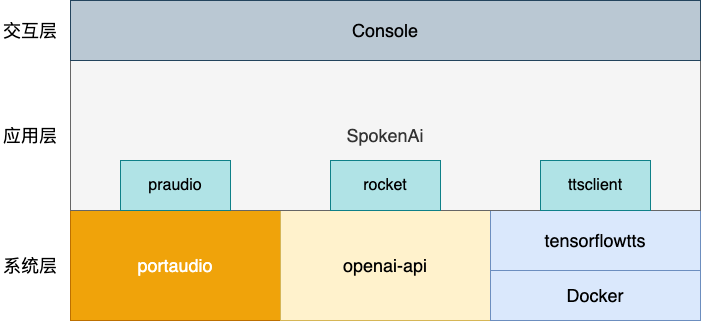
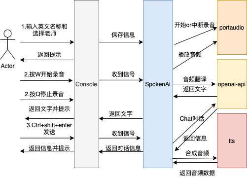

# SpokenAi
English | [PT-BR](./README-zh.md)
<p>
	<p align="center">
		
	</p>
	<p align="center">
		<font size=6 face="宋体">Assistente de IA para prática de conversação em inglês</font>
	<p>
</p>
<p align="center">


</p>

## I. Preâmbulo

Nos últimos meses, o ChatGPT foi lançado na versão ChatGPT4, e eu tenho me preocupado com o desenvolvimento do ChatGPT, pensando que ele pode se basear no ChatGPT ou na capacidade de dizer que o openai pode fazer questão de quais aplicativos, para resolver alguns dos problemas!.

💥Depois de dar uma olhada na [documentação da API] do openai (https://platform.openai.com/), descobri que o openai oferece não apenas os recursos do Chat, mas também recursos como fala para texto, geração de imagens e assim por diante. Embora não seja tão bom quanto o ChatGPT, depois de alguns testes, descobri que ele é tão incrível quanto o ChatGPT. Portanto, é diretamente o balde da família openai, por meio da capacidade openai de desenvolver um aplicativo para experimentar.

Desenvolvendo o quê? 🤔

ChatGPT sobre as habilidades no idioma inglês, naturalmente, não é preciso dizer, e nossos compatriotas enfrentam um grande problema no aprendizado de inglês, que é o inglês mudo. O mercado oferece robôs de diálogo em inglês e o ChatGPT, em comparação com a diferença, não é meia estrela. Você só pode contratar um professor para dar aulas particulares pessoalmente? 🤨  Vamos lá, estamos em 2023, ainda precisamos pagar por um professor de oratória?

Vamos criar um aplicativo de prática de fala em áudio para resolver esse problema! 💯

## II. Funções de suporte

Atualmente, é uma versão simples da função de prática de conversação em inglês, que oferece suporte às seguintes funções
1. Ler entrada de voz
2. conversão de voz em texto
3. Comunique-se por meio do ChatGPT
4. Texto para áudio
5. Reprodução de áudio

ToDoList：  
- [ ]  Procurando parceiros com a mesma mentalidade que estejam interessados em criar um aplicativo Ai juntos, entre em contato comigo!!!!
- [ ]  Correção de bugs, conhecidos: problemas de compatibilidade de áudio de reprodução do mac, o Tensorflowtts não suporta declarações longas (>2048 bytes) de voz sintetizada
- [ ]  Codificação de serviços de back-end

## III. Arquitetura do sistema
<p align="center">
      
</p>

- portaudio: PortAudio é uma biblioteca de E/S de áudio multiplataforma que fornece APIs simples que permitem aos desenvolvedores acessar o hardware de áudio de forma semelhante em diferentes plataformas. Ela é compatível com Windows, Mac OS X, Linux e outros sistemas operacionais importantes. O PortAudio é compatível com uma ampla variedade de APIs de áudio, incluindo ASIO, Core Audio, DirectSound, MME/WDM, ALSA e OSS. O PortAudio também inclui uma interface de streaming que permite que os desenvolvedores usem APIs e hardware de áudio diferentes da mesma forma que usam APIs e hardware de áudio diferentes. com diferentes APIs de áudio e hardware.   

- openai-api: fornece uma variedade de serviços de API, incluindo, entre outros, processamento de linguagem natural, conversão de fala em texto, conversão de texto em fala, geração de imagens e muito mais. Na documentação da API da OpenAI, os usuários podem solicitar chaves de API e usar a API para desenvolvimento e teste.

- tensorflowtts: o [TensorflowTTS] (https://github.com/TensorSpeech/TensorflowTTS) é um kit de ferramentas de síntese de fala baseado no TensorFlow que contém uma ampla variedade de modelos de síntese de fala e ferramentas de pré-processamento, além de oferecer suporte a várias tarefas de síntese de fala como síntese de voz humana (Vocoder), conversão de fala, aprimoramento de fala e assim por diante. Ele ajuda os desenvolvedores a criar rapidamente modelos de síntese de fala e a personalizar seus próprios sistemas de síntese de fala.
- Docker: o Docker é uma tecnologia de conteinerização que empacota aplicativos e suas dependências em um contêiner para execução em qualquer lugar. Os contêineres são uma tecnologia de virtualização leve que oferece isolamento e segurança semelhantes aos das máquinas virtuais tradicionais, mas ocupa menos recursos. O Docker também oferece um conjunto de ferramentas e plataformas que facilitam a criação, a implantação e o gerenciamento de contêineres.

- SpokenAi:A camada geral do aplicativo, na qual há três bibliotecas, praudio, rocket e ttsclient, corresponde às seguintes funções
    1. praudio: Encapsulam o portaudio para fornecer interfaces para gravação e reprodução de áudio.
    2. rocket: Encapsular o openai-api, fornecer interface de bate-papo externa, interface de áudio para texto, etc.
    3. ttsclient: Fornecer uma interface para chamar tensorflowtts em execução em contêineres
- Console: Camada de interação do terminal, onde o usuário é solicitado a operar, inserir informações e realizar operações relacionadas

   Tips:tensorflowtts Há mais dependências, portanto, para fins de integridade, aqui está a implantação do Docker

## IV. Projeto do processo

<p align="center">
      
</p>

Para resumir brevemente o processo geral, há três etapas: uma é a inserção de informações pessoais, a segunda é a conversão de áudio em texto e a terceira é o envio de uma mensagem para interação de diálogo.

Como é acessado por meio do terminal, ele ouve principalmente os eventos do teclado e executa diferentes operações.

Por exemplo, pressione W para iniciar a gravação, pressione Q para interromper a gravação e pressione Ctrl+shift+enter para enviar uma mensagem quando a gravação for concluída.

## V. Execução da implantação

### Compilar e executar

I. Instalação de dependências no portaudio

```bash

1. Windows: [http://www.portaudio.com/download.html](http://www.portaudio.com/download.html)
2. MacOS: brew install portaudio
3. Linux: apt-get install portaudio19-dev
```

II. Compilação do código

```bash
# 下载源码
git clone https://github.com/ptonlix/spokenai.git
cd spokenai

# 修改配置文件
edit fat_config.toml

# 编译
go build

# 查看命令
./spokenai -h

# 运行
./spokenai
```

III. Execução do TensorflowTTS

```
# Puxe os espelhos que foram construídos pelo autor
docker pull ptonlix/tensorflowtts:1.0.9
# 运行镜像
docker run -itd -p 5000:5000 --name spokenai-tts ptonlix/tensorflowtts:1.0.9
```
### Descrição do arquivo de configuração

```bash
[openai]

  [openai.base]
    apikey = ""
    apihost = "https://api.openai.com/v1" 

  [openai.chat]
    chatmodel =  "gpt-3.5-turbo"
    chatmaxtoken = 2048
    chattemperature = 0.7
    chattopp = 1

  [openai.audio]
    audiomodel = "whisper-1"
  
[file]
  [file.history]
    path = "./data/history/"
  [file.audio]
    [file.audio.record]
      path = "./data/audio/record/"
    [file.audio.play]
      path = "./data/audio/play/"
      enable =  0
      ttshost = "http://127.0.0.1:5000"
```

O formato de arquivo de configuração toml é usado e está dividido em duas seções principais

1. Configuração do openai, principalmente a necessidade de preencher a apikey e, se você for ao proxy, modificar o endereço do apihost. Outras configurações do modelo podem ser modificadas conforme necessário
2. configuração de arquivos, por ser uma versão de terminal, é mais conveniente usar o formato de armazenamento de arquivos
    - Histórico do Chat Context Store
    - áudio para armazenamento de áudio
        - record é o diretório de armazenamento do arquivo de gravação
        - play é o diretório de armazenamento dos arquivos de síntese de linguagem
        - enable Você pode escolher se deseja ativar ou não a síntese de fala; o padrão é não abrir, é necessário abrir para executar o tensorflowtts.
        - ttshost Endereço de serviço para tts api


<p align="center">
  <b>SPONSORED BY</b>
</p>
<p align="center">
   <a href="https://www.gogeek.com.cn/" title="gogeek" target="_blank">
      
   </a>
</p>
